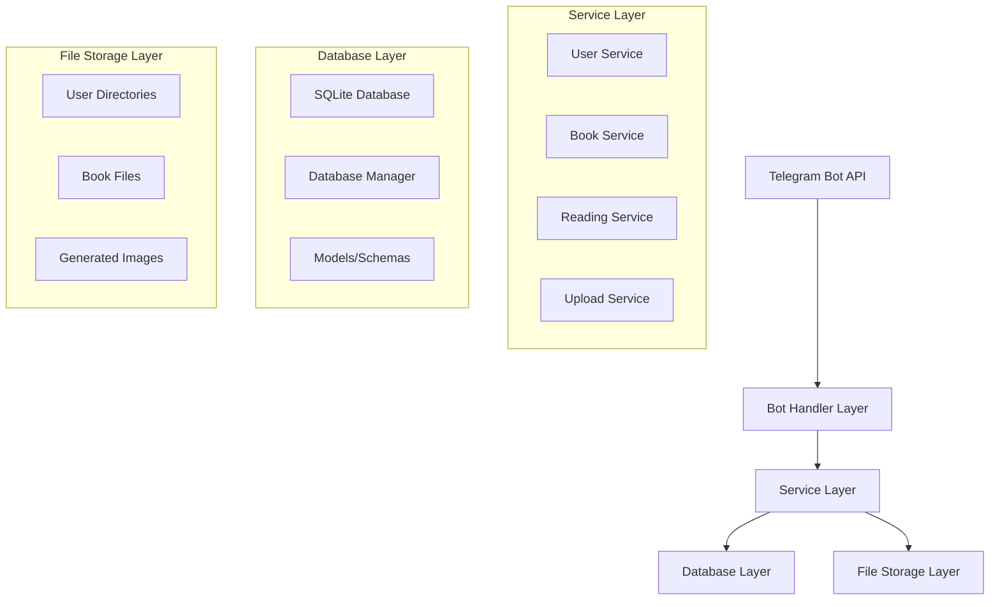

# Design Document

## Overview

This design implements a comprehensive user-specific book upload system that transforms the current single-book PDF Sender Bot into a multi-user, multi-book platform. The system will replace JSON file storage with a proper SQLite database and implement secure, isolated book management for each user.

## Architecture

### High-Level Architecture



### Database Schema Migration

The system will migrate from JSON to SQLite with the following schema:

```sql
-- Users table
CREATE TABLE users (
    id INTEGER PRIMARY KEY,
    telegram_id INTEGER UNIQUE NOT NULL,
    username TEXT,
    joined_at TIMESTAMP DEFAULT CURRENT_TIMESTAMP,
    active_book_id INTEGER,
    total_points INTEGER DEFAULT 0,
    level INTEGER DEFAULT 1,
    experience INTEGER DEFAULT 0,
    current_streak INTEGER DEFAULT 0,
    longest_streak INTEGER DEFAULT 0,
    last_read_date DATE,
    created_at TIMESTAMP DEFAULT CURRENT_TIMESTAMP,
    updated_at TIMESTAMP DEFAULT CURRENT_TIMESTAMP,
    FOREIGN KEY (active_book_id) REFERENCES books (id)
);

-- Books table
CREATE TABLE books (
    id INTEGER PRIMARY KEY AUTOINCREMENT,
    user_id INTEGER NOT NULL,
    title TEXT NOT NULL,
    filename TEXT NOT NULL,
    file_path TEXT NOT NULL,
    file_size INTEGER NOT NULL,
    total_pages INTEGER NOT NULL,
    current_page INTEGER DEFAULT 1,
    is_completed BOOLEAN DEFAULT FALSE,
    upload_date TIMESTAMP DEFAULT CURRENT_TIMESTAMP,
    last_read TIMESTAMP,
    created_at TIMESTAMP DEFAULT CURRENT_TIMESTAMP,
    updated_at TIMESTAMP DEFAULT CURRENT_TIMESTAMP,
    FOREIGN KEY (user_id) REFERENCES users (id) ON DELETE CASCADE
);

-- User settings table
CREATE TABLE user_settings (
    id INTEGER PRIMARY KEY AUTOINCREMENT,
    user_id INTEGER UNIQUE NOT NULL,
    pages_per_send INTEGER DEFAULT 3,
    interval_hours INTEGER DEFAULT 6,
    schedule_time TEXT DEFAULT '14:00',
    auto_send_enabled BOOLEAN DEFAULT TRUE,
    notifications_enabled BOOLEAN DEFAULT TRUE,
    image_quality INTEGER DEFAULT 85,
    created_at TIMESTAMP DEFAULT CURRENT_TIMESTAMP,
    updated_at TIMESTAMP DEFAULT CURRENT_TIMESTAMP,
    FOREIGN KEY (user_id) REFERENCES users (id) ON DELETE CASCADE
);

-- Reading sessions table
CREATE TABLE reading_sessions (
    id INTEGER PRIMARY KEY AUTOINCREMENT,
    user_id INTEGER NOT NULL,
    book_id INTEGER NOT NULL,
    pages_read INTEGER NOT NULL,
    duration_minutes INTEGER,
    points_earned INTEGER DEFAULT 0,
    session_date TIMESTAMP DEFAULT CURRENT_TIMESTAMP,
    FOREIGN KEY (user_id) REFERENCES users (id) ON DELETE CASCADE,
    FOREIGN KEY (book_id) REFERENCES books (id) ON DELETE CASCADE
);

-- Achievements table (predefined achievements)
CREATE TABLE achievements (
    id INTEGER PRIMARY KEY AUTOINCREMENT,
    achievement_key TEXT UNIQUE NOT NULL,
    name TEXT NOT NULL,
    description TEXT NOT NULL,
    points INTEGER NOT NULL,
    icon TEXT NOT NULL
);

-- User achievements table (unlocked achievements)
CREATE TABLE user_achievements (
    id INTEGER PRIMARY KEY AUTOINCREMENT,
    user_id INTEGER NOT NULL,
    achievement_id INTEGER NOT NULL,
    unlocked_at TIMESTAMP DEFAULT CURRENT_TIMESTAMP,
    FOREIGN KEY (user_id) REFERENCES users (id) ON DELETE CASCADE,
    FOREIGN KEY (achievement_id) REFERENCES achievements (id) ON DELETE CASCADE,
    UNIQUE(user_id, achievement_id)
);
```

## Components and Interfaces

### 1. Database Manager (Enhanced)

**Purpose**: Manage all database operations with proper SQL database support

**Key Methods**:
```python
class DatabaseManager:
    def __init__(self, db_path: str)
    
    # User management
    async def create_user(self, telegram_id: int, username: str) -> User
    async def get_user_by_telegram_id(self, telegram_id: int) -> Optional[User]
    async def update_user(self, user: User) -> bool
    
    # Book management
    async def create_book(self, user_id: int, book_data: BookCreate) -> Book
    async def get_user_books(self, user_id: int) -> List[Book]
    async def get_book_by_id(self, book_id: int, user_id: int) -> Optional[Book]
    async def update_book(self, book: Book) -> bool
    async def delete_book(self, book_id: int, user_id: int) -> bool
    async def set_active_book(self, user_id: int, book_id: int) -> bool
    
    # Reading progress
    async def update_reading_progress(self, user_id: int, book_id: int, page: int)
    async def complete_book(self, user_id: int, book_id: int)
    
    # Migration utilities
    async def migrate_from_json(self, json_path: str) -> bool
```

### 2. Book Service (New)

**Purpose**: Handle all book-related business logic

**Key Methods**:
```python
class BookService:
    def __init__(self, db: DatabaseManager, file_manager: FileManager)
    
    async def upload_book(self, user_id: int, file_data: UploadedFile) -> BookUploadResult
    async def get_user_library(self, user_id: int) -> List[Book]
    async def select_active_book(self, user_id: int, book_id: int) -> bool
    async def delete_book(self, user_id: int, book_id: int) -> bool
    async def get_book_metadata(self, book_id: int, user_id: int) -> BookMetadata
```

### 3. File Manager (New)

**Purpose**: Handle secure file storage and organization

**Key Methods**:
```python
class FileManager:
    def __init__(self, base_upload_dir: str)
    
    def get_user_directory(self, user_id: int) -> Path
    def get_user_books_directory(self, user_id: int) -> Path
    def get_user_images_directory(self, user_id: int) -> Path
    
    async def store_uploaded_file(self, user_id: int, file_data: UploadedFile) -> str
    async def delete_user_file(self, user_id: int, filename: str) -> bool
    async def cleanup_user_files(self, user_id: int) -> bool
    
    def generate_unique_filename(self, user_id: int, original_filename: str) -> str
    def validate_file_access(self, user_id: int, file_path: str) -> bool
```

### 4. Upload Service (New)

**Purpose**: Handle file upload processing and validation

**Key Methods**:
```python
class UploadService:
    def __init__(self, file_manager: FileManager, validator: FileValidator)
    
    async def process_upload(self, user_id: int, telegram_file: File) -> UploadResult
    async def validate_upload(self, file_data: UploadedFile) -> ValidationResult
    async def extract_book_metadata(self, file_path: str) -> BookMetadata
    async def process_large_file(self, user_id: int, file_data: UploadedFile) -> UploadResult
```

### 5. Enhanced PDF Reader

**Purpose**: Extended PDF processing with user-specific functionality

**Key Enhancements**:
```python
class PDFReader:
    def __init__(self, db: DatabaseManager, file_manager: FileManager)
    
    async def get_user_pdf_reader(self, user_id: int, book_id: int) -> Optional[PDFReader]
    async def extract_pages_for_user(self, user_id: int, book_id: int, start_page: int, count: int) -> List[str]
    async def get_book_total_pages(self, book_id: int, user_id: int) -> int
    async def cleanup_user_images(self, user_id: int, book_id: int, keep_latest: int = 10)
```

## Data Models

### Core Models

```python
@dataclass
class User:
    id: Optional[int]
    telegram_id: int
    username: Optional[str]
    joined_at: datetime
    active_book_id: Optional[int]
    total_points: int = 0
    level: int = 1
    experience: int = 0
    current_streak: int = 0
    longest_streak: int = 0
    last_read_date: Optional[date] = None

@dataclass
class Book:
    id: Optional[int]
    user_id: int
    title: str
    filename: str
    file_path: str
    file_size: int
    total_pages: int
    current_page: int = 1
    is_completed: bool = False
    upload_date: datetime
    last_read: Optional[datetime] = None

@dataclass
class UserSettings:
    user_id: int
    pages_per_send: int = 3
    interval_hours: int = 6
    schedule_time: str = "14:00"
    auto_send_enabled: bool = True
    notifications_enabled: bool = True
    image_quality: int = 85

@dataclass
class BookUploadResult:
    success: bool
    book: Optional[Book]
    error_message: Optional[str]
    validation_errors: List[str]
```

## File Storage Structure

```
uploads/
├── users/
│   ├── {user_id}/
│   │   ├── books/
│   │   │   ├── {book_id}_{sanitized_filename}.pdf
│   │   │   └── {book_id}_{sanitized_filename}_v2.pdf
│   │   └── images/
│   │       ├── {book_id}/
│   │       │   ├── page_1.jpg
│   │       │   ├── page_2.jpg
│   │       │   └── ...
│   │       └── temp/
│   └── {user_id}/
└── temp/
    └── uploads/
```

## Error Handling

### Error Categories

1. **Validation Errors**
   - File format validation
   - File size limits
   - Corrupted files
   - Unsupported PDF features

2. **Storage Errors**
   - Disk space issues
   - Permission problems
   - File system errors

3. **Database Errors**
   - Connection failures
   - Constraint violations
   - Transaction rollbacks

4. **Security Errors**
   - Unauthorized access attempts
   - Path traversal attempts
   - Malicious file uploads

### Error Handling Strategy

```python
class BookUploadError(Exception):
    def __init__(self, message: str, error_code: str, details: Optional[Dict] = None):
        self.message = message
        self.error_code = error_code
        self.details = details or {}

class ErrorHandler:
    @staticmethod
    async def handle_upload_error(error: Exception, user_id: int) -> UserFriendlyError:
        # Log error with context
        # Return user-friendly message
        # Clean up partial uploads
        # Update metrics
```

## Testing Strategy

### Unit Tests

1. **Database Operations**
   - CRUD operations for all models
   - Transaction handling
   - Migration scripts
   - Connection pooling

2. **File Operations**
   - Upload processing
   - File validation
   - Storage management
   - Cleanup operations

3. **Business Logic**
   - Book management workflows
   - User library operations
   - Reading progress tracking
   - Achievement system

### Integration Tests

1. **End-to-End Upload Flow**
   - File upload → validation → storage → database update
   - Error scenarios and rollbacks
   - Large file handling

2. **Multi-User Scenarios**
   - Concurrent uploads
   - User isolation
   - Resource sharing

3. **Database Migration**
   - JSON to SQLite migration
   - Data integrity verification
   - Rollback procedures

### Performance Tests

1. **File Upload Performance**
   - Large file uploads (up to 50MB)
   - Concurrent upload handling
   - Memory usage during processing

2. **Database Performance**
   - Query performance with multiple users
   - Index effectiveness
   - Connection pooling efficiency

## Security Considerations

### File Security

1. **Upload Validation**
   - Strict MIME type checking
   - File content validation
   - Size limit enforcement
   - Malware scanning (future enhancement)

2. **Storage Security**
   - User-isolated directories
   - Proper file permissions
   - Path traversal prevention
   - Secure filename generation

3. **Access Control**
   - User ownership verification
   - Session-based access control
   - Rate limiting on uploads

### Database Security

1. **SQL Injection Prevention**
   - Parameterized queries
   - Input sanitization
   - ORM usage where appropriate

2. **Data Protection**
   - Encrypted sensitive data
   - Secure connection strings
   - Regular backups

## Migration Strategy

### Phase 1: Database Migration

1. Create new SQLite database with schema
2. Implement migration script for existing JSON data
3. Run migration with data validation
4. Keep JSON backup until migration is verified

### Phase 2: File System Reorganization

1. Create new user-specific directory structure
2. Move existing files to user directories
3. Update database with new file paths
4. Clean up old file structure

### Phase 3: Feature Implementation

1. Implement new book upload functionality
2. Add multi-book support to existing features
3. Update UI to show book selection
4. Add book management commands

### Phase 4: Testing and Rollout

1. Comprehensive testing with existing users
2. Gradual rollout with feature flags
3. Monitor system performance and errors
4. Full deployment with monitoring

## Performance Optimizations

### Database Optimizations

1. **Indexing Strategy**
   ```sql
   CREATE INDEX idx_users_telegram_id ON users(telegram_id);
   CREATE INDEX idx_books_user_id ON books(user_id);
   CREATE INDEX idx_books_active ON books(user_id, is_completed);
   CREATE INDEX idx_reading_sessions_user_book ON reading_sessions(user_id, book_id);
   ```

2. **Connection Pooling**
   - Implement SQLite connection pooling
   - Optimize connection lifecycle
   - Handle concurrent access properly

### File Processing Optimizations

1. **Async Processing**
   - Async file uploads
   - Background PDF processing
   - Non-blocking image generation

2. **Caching Strategy**
   - Cache frequently accessed pages
   - Implement LRU cache for images
   - Cache book metadata

3. **Resource Management**
   - Memory-efficient PDF processing
   - Cleanup of temporary files
   - Disk space monitoring